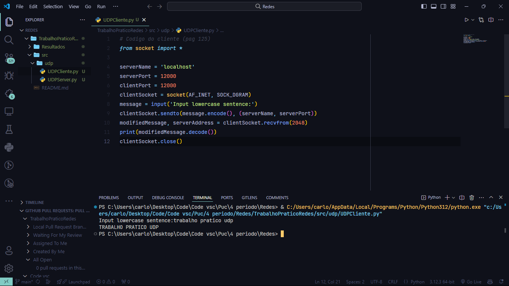
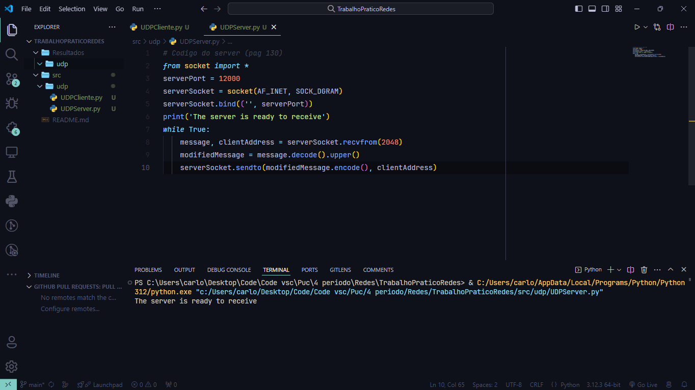
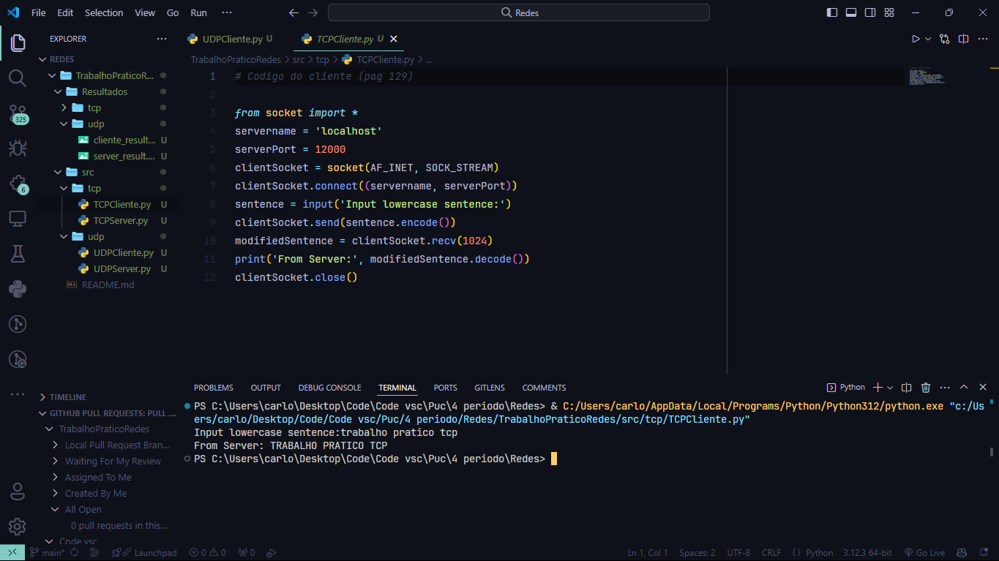
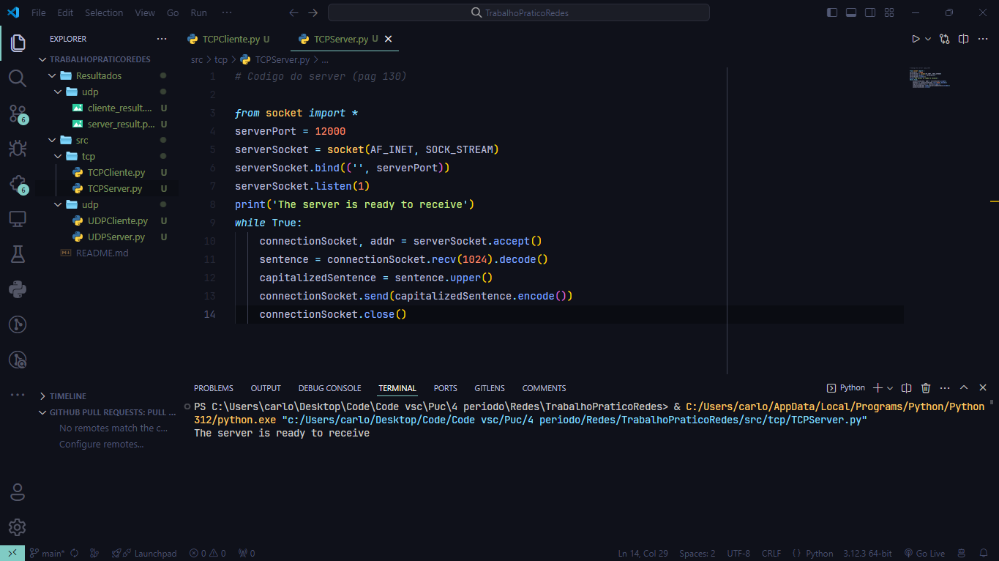
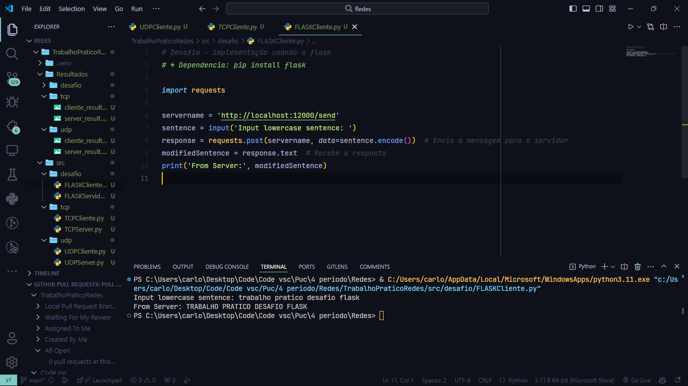
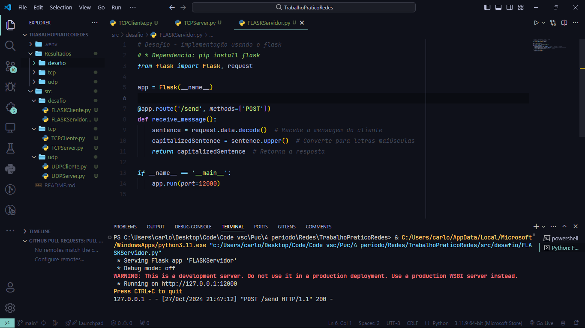

# Redes de Computadores – Trabalho Prático 1
Implementar e executar cada um dos códigos exemplos de sockets (UDP e TCP) do livro Redes
de Computadores e a Internet 8ª edição do Kurose (a partir da pág. 122).
Faça um relatório que contenha, para cada situação (UDP e TCP):
1. Executar os códigos cliente e servidor e capturar as telas de saída.
2. Fazer uma análise do funcionamento de cada código, explicando o que acontece em cada
linha. Consulte fontes externas como livros ou manual pages (man), se necessário.
3. DESAFIO: Faça uma nova execução/captura usando um servidor diferente, como nc
(netcat) ou mesmo alguma implementação diferente, conforme a situação. Explique como
foi feito e cada um dos parâmetros necessários para a operação.

----

## 1 Executar os códigos cliente e servidor e capturar as telas de saída

### UDP

**Cliente:**


**Server:**


### TCP

**Cliente:**


**Server:**


## 2 Fazer uma análise do funcionamento de cada código, explicando o que acontece em cada linha. Consulte fontes externas como livros ou manual pages (man), se necessário.

## Código do Cliente (TCP) - Página 129

```python
from socket import *
```
- **Importa todas as classes e funções do módulo `socket`,** que fornece acesso à interface de rede do sistema.

```python
servername = 'localhost'
serverPort = 12000
```
- **Define o nome do servidor como `localhost`** (endereço IP 127.0.0.1), indicando que o cliente se conecta ao mesmo computador em que está sendo executado. `serverPort` é definido como 12000, que é a porta de comunicação.

```python
clientSocket = socket(AF_INET, SOCK_STREAM)
```
- **Cria um socket usando IPv4 (`AF_INET`) e o protocolo TCP (`SOCK_STREAM`).** Isso indica que o socket usará uma conexão orientada a dados.

```python
clientSocket.connect((servername, serverPort))
```
- **Estabelece uma conexão com o servidor especificado em `servername` e `serverPort`.** O cliente tenta se conectar ao servidor na porta 12000.

```python
sentence = input('Input lowercase sentence:')
```
- **Solicita ao usuário que insira uma frase em letras minúsculas.** A entrada do usuário será enviada ao servidor.

```python
clientSocket.send(sentence.encode())
```
- **Converte a frase digitada em bytes e a envia para o servidor.** O método `encode()` transforma a string em um formato adequado para transmissão.

```python
modifiedSentence = clientSocket.recv(1024)
```
- **Aguarda a resposta do servidor.** O cliente recebe até 1024 bytes de dados, que são a resposta do servidor.

```python
print('From Server:', modifiedSentence.decode())
```
- **Decodifica os dados recebidos de bytes para string** e imprime a resposta do servidor.

```python
clientSocket.close()
```
- **Fecha o socket, encerrando a conexão.**

---

## Código do Servidor (TCP) - Página 130

```python
from socket import *
```
- **Importa o módulo `socket`** como no cliente.

```python
serverPort = 12000
```
- **Define a porta do servidor como 12000.**

```python
serverSocket = socket(AF_INET, SOCK_STREAM)
```
- **Cria um socket que usa IPv4 e o protocolo TCP.**

```python
serverSocket.bind(('', serverPort))
```
- **Associa o socket a uma porta no sistema.** O parâmetro `''` permite que o servidor escute em todas as interfaces disponíveis.

```python
serverSocket.listen(1)
```
- **Coloca o socket em modo de escuta,** permitindo que ele aceite conexões de clientes. O argumento `1` define o número máximo de conexões pendentes.

```python
print('The server is ready to receive')
```
- **Imprime uma mensagem indicando que o servidor está pronto para receber conexões.**

```python
while True:
```
- **Inicia um loop infinito para aceitar múltiplas conexões de clientes.**

```python
connectionSocket, addr = serverSocket.accept()
```
- **Aceita uma conexão de um cliente.** `connectionSocket` é um novo socket que representa a conexão com o cliente, e `addr` contém o endereço do cliente.

```python
sentence = connectionSocket.recv(1024).decode()
```
- **Recebe dados do cliente (até 1024 bytes)** e decodifica os bytes para uma string.

```python
capitalizedSentence = sentence.upper()
```
- **Converte a frase recebida para letras maiúsculas.**

```python
connectionSocket.send(capitalizedSentence.encode())
```
- **Envia a frase modificada (em maiúsculas) de volta ao cliente.**

```python
connectionSocket.close()
```
- **Fecha o socket da conexão com o cliente.** Isso permite que o servidor aceite novas conexões.

---

## Código do Cliente (UDP) - Página 125

```python
from socket import *
```
- **Importa o módulo `socket`** como nos exemplos anteriores.

```python
serverName = 'localhost'
serverPort = 12000
clientPort = 12000
```
- **Define o nome do servidor e a porta como `localhost` e 12000,** respectivamente. `clientPort` é definido mas não é usado.

```python
clientSocket = socket(AF_INET, SOCK_DGRAM)
```
- **Cria um socket que usa IPv4 e o protocolo UDP (`SOCK_DGRAM`).** UDP é um protocolo sem conexão.

```python
message = input('Input lowercase sentence:')
```
- **Solicita ao usuário que insira uma mensagem.**

```python
clientSocket.sendto(message.encode(), (serverName, serverPort))
```
- **Converte a mensagem para bytes e a envia ao servidor.** O método `sendto()` é usado, que envia a mensagem diretamente para um endereço específico.

```python
modifiedMessage, serverAddress = clientSocket.recvfrom(2048)
```
- **Aguarda a resposta do servidor.** O cliente recebe a resposta de até 2048 bytes e o endereço do servidor.

```python
print(modifiedMessage.decode())
```
- **Decodifica e imprime a resposta do servidor.**

```python
clientSocket.close()
```
- **Fecha o socket.**

---

## Código do Servidor (UDP) - Página 130

```python
from socket import *
```
- **Importa o módulo `socket`.**

```python
serverPort = 12000
```
- **Define a porta do servidor como 12000.**

```python
serverSocket = socket(AF_INET, SOCK_DGRAM)
```
- **Cria um socket que usa IPv4 e o protocolo UDP.**

```python
serverSocket.bind(('', serverPort))
```
- **Associa o socket a uma porta no sistema.** O parâmetro `''` permite que o servidor escute em todas as interfaces disponíveis.

```python
print('The server is ready to receive')
```
- **Imprime uma mensagem indicando que o servidor está pronto.**

```python
while True:
```
- **Inicia um loop infinito para aceitar múltiplas mensagens de clientes.**

```python
message, clientAddress = serverSocket.recvfrom(2048)
```
- **Recebe dados de um cliente.** O servidor recebe até 2048 bytes e captura o endereço do cliente.

```python
modifiedMessage = message.decode().upper()
```
- **Decodifica a mensagem e a converte para letras maiúsculas.**

```python
serverSocket.sendto(modifiedMessage.encode(), clientAddress)
```
- **Envia a resposta modificada (em maiúsculas) de volta ao cliente.**


## 3 DESAFIO: Faça uma nova execução/captura usando um servidor diferente, como nc (netcat) ou mesmo alguma implementação diferente, conforme a situação. Explique como foi feito e cada um dos parâmetros necessários para a operação.

**Cliente:**


**Server:**
